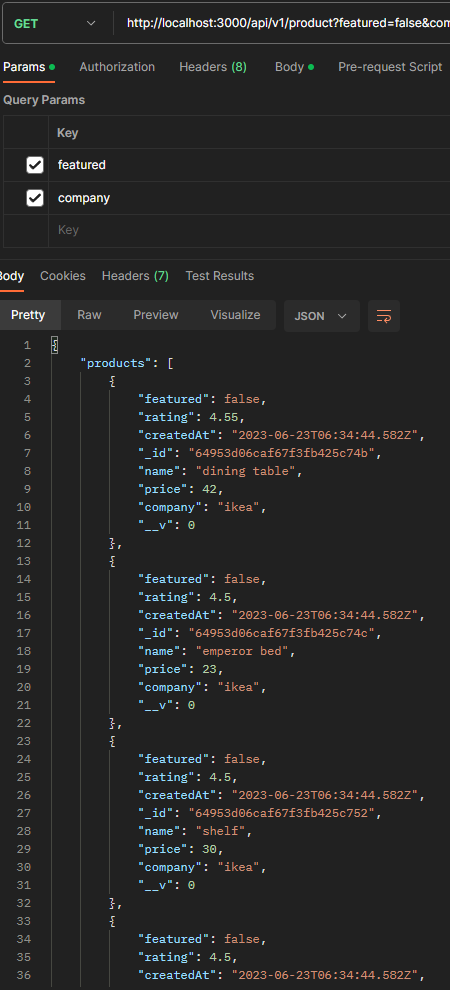

## we gonna check our query
## http://localhost:3000/api/v1/product?featured=false&company=ikea
### this call qurey ?featured=false&company=ikea 
```js
const getAllProducts = async (req,res)=>{ 
    const {featured,company} = req.query; // here we will check our url (query)

    const queryObject ={} //we create qurey object

 // these two if means if we get in our url http://localhost:3000/api/v1/product?featured=false&company=ikea

    if(featured){ // if the qurey paramter is true set queryObject to true else set to false
        queryObject.featured = featured === 'true'? true : false

    } if (company){// if the qurey paramter is company set queryObject to company
        queryObject.company = company
    }
        console.log(queryObject);

const products = await Product.find(queryObject); //here we bring all product form database to do the test
  res.status(200).json({products,nbHits: products.length})
}
```
# now in postman
 ## i send requset  http://localhost:3000/api/v1/product?featured=false&company=ikea
 ### and i get all data  they have compney name ikea and the featured of them are false


